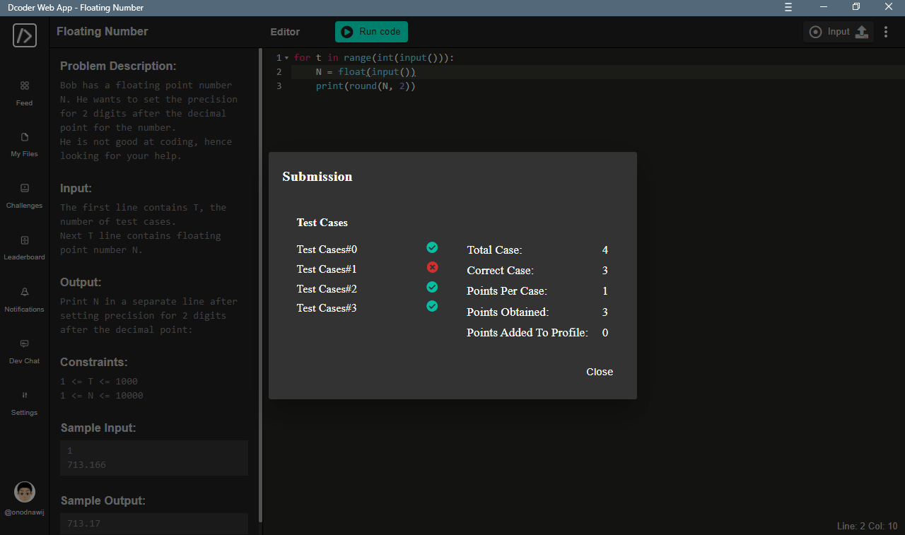

# Solution

## Understanding
Remember, the challenge has some cases with notated as `T`. So I will loop my code for `T` times.
For each case, I have a [Float](https://www.geeksforgeeks.org/python-float-type-and-its-methods/#:~:text=The%20float%20type%20in%20Python,all%20are%20floating%20point%20numbers.) number. I must set the precision for 2 digits after it's decimal point.\
Luckily, Python make it easier because there is built-in `round()` function that can do the job. :smile:

## Try

### Accept the inputs:
Assign the `T` for the loop and `N` inside it.
```python
for t in range(int(input())):
	N = float(input())
```

### Do the Logical
As we know, to round a number is *if the number that will be rounded is 5 or above, than it will round upward and vice versa*.\
e.g If the rounded version of `15` or `16` must be `20`. And for `14` it will be `10`

Quick intro for `round()` function:
```python
float_number = 173.26355
decimal_places = 3
x = round(float_number, decimal_places)   #put your number on first argument, and the max digits after decimal point as the second.
```
If we printed the `x`, the output will be like this.
```python
print(x)
>>> 173.264
```

So, the code is as simple as this:
```python
for t in range(int(input())):
	N = float(input())
	print(round(N, 2))
```

After submitting, is fun and games until Dcoder says that code isn't working for some cases. :sad:\


Thats not a big problem !
Because Python *the almighty* has another way to solve that :smile:\
For that, I tried to use [String Formating](https://realpython.com/python-string-formatting/).

Now i changed the code from this:
```python
    print(round(N, 2))
```
into this:
```python
    print(f'{N:.2f}')   #This will convert float to string, but with 2 decimal places format (notice the .2f)
```

## Wrap Up
The final code will be like this:
```python
for t in range(int(input())):
    N = float(input())
    print(f'{N:.2f}')
```

### Solved!