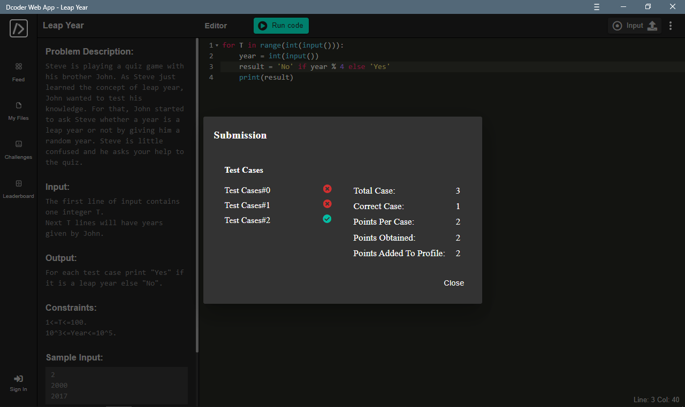

# Solution

## Understanding
Pretty simple. My task is to check wether given `year` is a leap year or not.

## Try

### Accept the inputs:
Assign the `T` for the loop then assign `year` inside the loop and convert it from string to integer.
```python
for T in range(int(input())):
	year = int(input())
```

### Do the Logical
In short, Leap Year is **any year that can be devided by 4**.\
To check wether a number can be divided by 4 in Python can be done by using the `%` [Modulo operator](https://www.freecodecamp.org/news/the-python-modulo-operator-what-does-the-symbol-mean-in-python-solved/#:~:text=The%20%25%20symbol%20in%20Python%20is,remainder%20of%20a%20division%20problem.).\
The `%` returns the remainder of left hand operand after divided by the right hand operand.\
For example:
```python
x = 12 % 4
y = 15 % 4

print(x, y)
>>> 0 3         # 0 is the remainder of 12, and 3 is the remainder of 15
```
With that we can use the result from `%` operation as a boolean and use it as a criteria in a condition. The boolean value will only be `False` if it is `0`, any number except `0` will be `True`.\
That means, if we `%` a number, it will return `False` if it can be devided by the other number, and otherwise.
So my code goes like this:
```python
    result = 'No' if year % 4 else 'Yes'
```
Submitted it, and it didn't work for some test case.


### Here's the catch
At this point, I remember back in school, there are years that can be divided by 4 but it isn't a leap year.\
After a quick research, the year that can be devided by 100 is not a leap year except it can be divided by 400.\
I decided to make it a function:
```python
def is_leap_year(n):
    if not year % 4:
        if not year % 100:
            if not year % 400:
                result = True
            else:
                result = False
        else:
            result = True
    else:
        result = False

    return result
```
Then changed my code a bit:
```python
    result = 'Yes' if is_leap_year(year) else 'No'
```

Aaaaannddd it works!

## Wrap Up
The final code will be like this:
```python
def is_leap_year(n):
    if not year % 4:
        if not year % 100:
            if not year % 400:
                result = True
            else:
                result = False
        else:
            result = True
    else:
        result = False

    return result

for T in range(int(input())):
    year = int(input())
    result = 'Yes' if is_leap_year(year) else 'No'
    print(result)
```

### Solved!