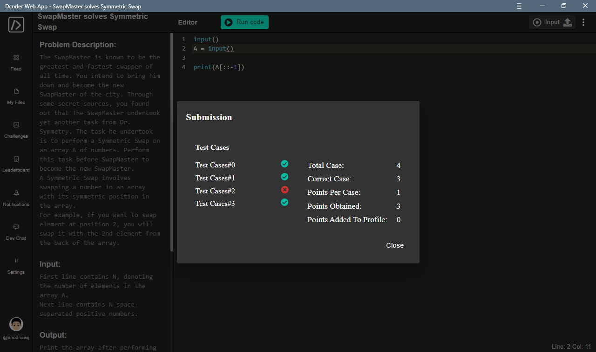

# Solution

## Understanding
Honestly, when doing this kind of challenge, I rarely read the problem description and just skip into the input output description :smile:\
Back to the problem. I have an array `A` with `N` length, and my job is to swap it symmetricly.\
Because they dont specify the element that must be swapped, I assume that I must swap it all. Or in other words, I must flip the order.

## Try

### Accept the inputs:
Because we can get the length of an array in Python, i think the first input is unused, so I'll ignore it.
```python
input()								#skip the N
A = input()
```

### Do the Logical
In Python, we can rearrange or slice a string like we do in array using `array[i:j:k]`.\
Where `i` is starting index, `j` end index, `k` step.
If you leave it blank `array[::]` it will be the default value of it, which is `array[0:len(array):1]`.\
`0` starting index, length of the array as end index, and `1` step.

So, to flip the order, we can slice it with negative step:
```python
A = A[::-1]		# If you put negative value in the step, it will step backwards or start from the last element to the first element.
```
Full code:
```python
input()
A = input()

print(A[::-1])
```

Unfortunately, some of the test case isn't solved using that code.


I don't really know why, but i think that's not a big problem.\
So I try to convert it to an array first, do the logic, and convert it back to string.
```python
A = input().split(' ')

print(' '.join(A[::-1]))
```

And that works! :smile:

## Wrap Up
The code will be like this:
```python
input()
A = input().split(' ')

print(' '.join(A[::-1]))
```

### Solved!